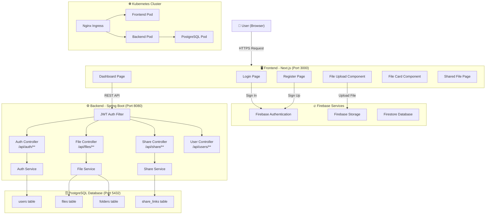

# 📁 File Sharing Platform

A full-stack file sharing web application built with **Next.js** (frontend), **Spring Boot** (backend), **PostgreSQL** (database), and **Firebase** (storage & auth). Containerized with **Docker** and deployable on **Kubernetes**.

---

## 🌐 Live Demo

> Deploy using Docker Compose or Kubernetes (see setup below)

---

## 🏗️ Architecture Overview



---

## ✨ Features

- 🔐 **User Authentication** — Register & login with Firebase Auth (JWT-secured backend)
- 📂 **File Management** — Upload, download, rename, and delete files
- 🗂️ **Folder Organization** — Create nested folders to organize files
- 🔗 **File Sharing** — Generate shareable links with expiry support
- 🔥 **Firebase Storage** — Scalable cloud file storage
- 📊 **Dashboard** — View storage usage, recent files, folder navigation
- 🐳 **Dockerized** — Full Docker Compose setup for local development
- ☸️ **Kubernetes Ready** — Production-grade K8s manifests included
- ⚙️ **CI/CD** — GitHub Actions workflows for build and deployment

---

## 🛠️ Tech Stack

| Layer        | Technology                        |
|--------------|-----------------------------------|
| Frontend     | Next.js 14, TypeScript, Tailwind CSS |
| Backend      | Spring Boot 3, Java 17, Maven     |
| Database     | PostgreSQL 16                     |
| Auth         | Firebase Authentication + JWT     |
| Storage      | Firebase Storage                  |
| Container    | Docker, Docker Compose            |
| Orchestration| Kubernetes (K8s)                  |
| CI/CD        | GitHub Actions                    |

---

## 📁 Project Structure

```
file-sharing-platform/
├── backend/                    # Spring Boot API
│   ├── src/main/java/com/filesharing/
│   │   ├── controller/         # REST Controllers
│   │   ├── service/            # Business Logic
│   │   ├── repository/         # JPA Repositories
│   │   ├── model/              # Database Entities
│   │   ├── dto/                # Data Transfer Objects
│   │   ├── security/           # JWT Filter & Service
│   │   └── config/             # CORS & Security Config
│   └── Dockerfile
├── frontend/                   # Next.js App
│   ├── src/
│   │   ├── app/                # App Router Pages
│   │   │   ├── (auth)/         # Login & Register
│   │   │   ├── dashboard/      # Main Dashboard
│   │   │   └── shared/[token]/ # Public Share Page
│   │   ├── components/         # Reusable UI Components
│   │   ├── lib/                # API, Auth, Firebase utils
│   │   └── types/              # TypeScript Types
│   └── Dockerfile
├── k8s/                        # Kubernetes Manifests
│   ├── backend/
│   ├── frontend/
│   ├── database/
│   └── ingress/
├── .github/workflows/          # CI/CD Pipelines
└── docker-compose.yml
```

---

## 🚀 Getting Started

### Prerequisites

- [Node.js 18+](https://nodejs.org/)
- [Java 17+](https://adoptium.net/)
- [Docker Desktop](https://www.docker.com/products/docker-desktop/)
- [Firebase Project](https://console.firebase.google.com/)

---

### 1. Clone the Repository

```bash
git clone https://github.com/shraddha835/file-sharing-platform.git
cd file-sharing-platform
```

---

### 2. Configure Firebase

1. Go to [Firebase Console](https://console.firebase.google.com/) → Create a project
2. Enable **Authentication** (Email/Password)
3. Enable **Firebase Storage**
4. Enable **Firestore Database**
5. Copy your Firebase config and update `frontend/src/lib/firebase.ts`:

```ts
const firebaseConfig = {
  apiKey: "YOUR_API_KEY",
  authDomain: "YOUR_AUTH_DOMAIN",
  projectId: "YOUR_PROJECT_ID",
  storageBucket: "YOUR_STORAGE_BUCKET",
  messagingSenderId: "YOUR_MESSAGING_SENDER_ID",
  appId: "YOUR_APP_ID"
};
```

---

### 3. Set Up Environment Variables

Create a `.env` file in the root:

```env
POSTGRES_DB=filesharingdb
POSTGRES_USER=postgres
POSTGRES_PASSWORD=postgres
JWT_SECRET=your_super_secret_jwt_key_at_least_32_chars
JWT_EXPIRATION=86400000
```

---

### 4. Run with Docker Compose

```bash
docker-compose up --build
```

| Service   | URL                        |
|-----------|----------------------------|
| Frontend  | http://localhost:3000       |
| Backend   | http://localhost:8080       |
| PostgreSQL| localhost:5432              |

---

### 5. Run Frontend Locally (without Docker)

```bash
cd frontend
npm install
npm run dev
```

---

## 🔑 API Endpoints

### Auth
| Method | Endpoint              | Description        |
|--------|-----------------------|--------------------|
| POST   | `/api/auth/register`  | Register new user  |
| POST   | `/api/auth/login`     | Login & get JWT    |

### Files
| Method | Endpoint              | Description        |
|--------|-----------------------|--------------------|
| GET    | `/api/files`          | List all files     |
| POST   | `/api/files/upload`   | Upload a file      |
| GET    | `/api/files/{id}`     | Download a file    |
| DELETE | `/api/files/{id}`     | Delete a file      |

### Folders
| Method | Endpoint              | Description        |
|--------|-----------------------|--------------------|
| GET    | `/api/folders`        | List folders       |
| POST   | `/api/folders`        | Create folder      |
| DELETE | `/api/folders/{id}`   | Delete folder      |

### Sharing
| Method | Endpoint                    | Description           |
|--------|-----------------------------|-----------------------|
| POST   | `/api/share`                | Create share link     |
| GET    | `/api/share/{token}`        | Access shared file    |

---

## ☸️ Kubernetes Deployment

```bash
kubectl apply -f k8s/namespace.yml
kubectl apply -f k8s/configmap.yml
kubectl apply -f k8s/secrets.yml
kubectl apply -f k8s/database/
kubectl apply -f k8s/backend/
kubectl apply -f k8s/frontend/
kubectl apply -f k8s/ingress/
```

---

## 🔄 CI/CD Pipeline

GitHub Actions workflows are set up in `.github/workflows/`:

- **`ci.yml`** — Runs on every push: builds and tests backend & frontend
- **`cd.yml`** — Runs on push to `main`: builds Docker images and deploys

---

## 👩‍💻 Author

**Shraddha S**
- GitHub: [@shraddha835](https://github.com/shraddha835)

---

## 📄 License

This project is licensed under the MIT License.
